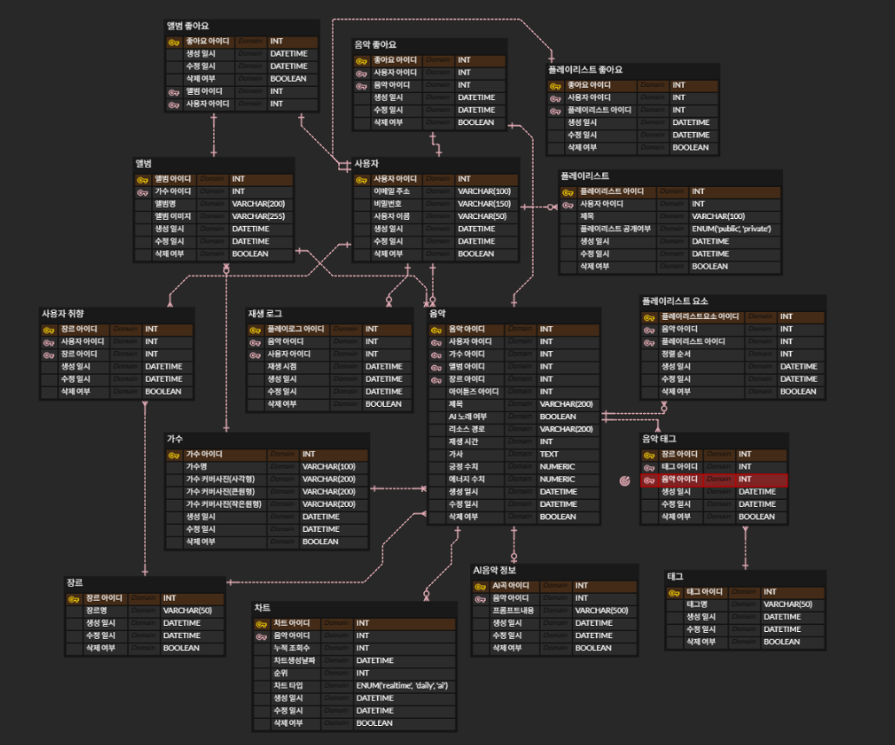

### <p align = center> 2025 Techeer Summer BootCamp-i 팀 <p>

### 🔗 URL list

# 

<p align="center">

</p>

<p align= center> (콘텐츠) 수많은 노래 속 자신의 취향을 찾아 떠는 세계 </p>

# 🎵 Service

| 홈화면

<br><br>
| 검색

<br><br>
| AI 음악 생성

<br><br>

# 🏗️ System Architechture


# 💡 Langchain & LMM 등

(어필하고 싶은 프레임워크들)


# 💾 ERD




# 🛠️ Tech Stack


| Category | Technology |
| :--- | :--- |
| **Frontend** |     |
| **Backend** |       |
| **Database & Search** |   |
| **Infrastructure** |    |
| **AI Pipeline** |      |
| **Monitoring** |      |
| **CI / CD** |  |


# 📊 Monitoring


# 🔌 API


# How to Start

### Clone Repository

```bash
$ git clone https://github.com/2025-TecheerBootcamp-team-i/Backend.git
```

### env setting in the Settings folder

- settings/.env

```text
SECRET_KEY = 
DEBUG = 
DJANGO_ALLOWED_HOSTS = 

SQL_ENGINE = 
SQL_DATABASE = 
SQL_USER = 
SQL_PASSWORD = 
SQL_HOST = 
SQL_PORT = 

CELERY_BROKER_URL = 

WINDOWS_LLAMA_IP = 
LLAMA_MODEL_NAME = 

NGROK_AUTHTOKEN = 

SUNO_API_URL = 
SUNO_MODEL_VERSION = 
SUNO_TEST_MODE = 
SUNO_API_KEY = 
SUNO_CALLBACK_URL = 

OPENSEARCH_HOST = 
OPENSEARCH_PORT = 
OPENSEARCH_USERNAME = 
OPENSEARCH_PASSWORD = 
OPENSEARCH_USE_SSL = 
OPENSEARCH_VERIFY_CERTS = 
OPENSEARCH_INDEX_PREFIX = 

AWS_ACCESS_KEY_ID = 
AWS_SECRET_ACCESS_KEY = 
AWS_STORAGE_BUCKET_NAME = 
AWS_S3_REGION_NAME = 
AWS_S3_CUSTOM_DOMAIN = 
```